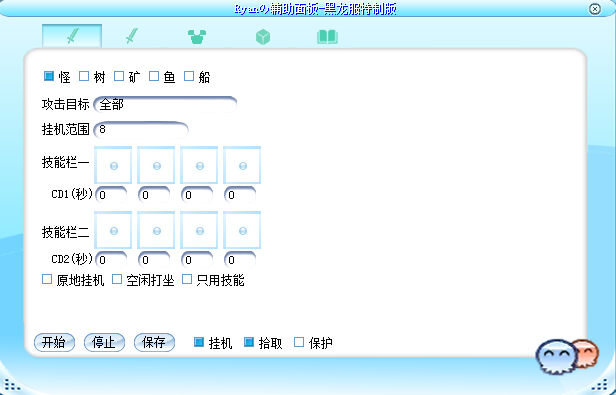

# Ryanの辅助面板v6.3-2025年8月黑龙海盗王端特制版

这是一个基于完整功能版本v6.3简化而来的辅助面板，移除了无API支持的功能，保留了基础的挂机、拾取、安全功能。

## ⚠️ 重要提示

**此内挂补丁需客户端开放API，非所有端都可使用，请自行甄别**

代码文件默认使用简体中文GB2312编码。

## 📋 功能特性

### 挂机功能
- ✅ 基础打怪功能
- ✅ 技能使用（支持8个技能栏）
- ✅ 技能CD控制
- ✅ 挂机点巡逻（支持20个挂机点）
- ✅ 原地挂机模式
- ✅ 空闲打坐功能
- ✅ 只用技能模式
- ✅ 攻击目标过滤（怪物、树木、矿物、鱼群、沉船）
- ✅ 挂机范围设置
- ✅ 沿途打怪检测
- ✅ 挂机点导入导出
- ✅ 挂机点配置文件管理

### 拾取功能
- ✅ 拾取全部物品
- ✅ 只拾取背包内道具
- ✅ 拾取延迟设置

### 保护功能
- ✅ 定时使用物品（支持6个物品）
- ✅ 物品使用间隔控制
- ✅ 物品启用/禁用开关
- ✅ HP保护（支持2个HP物品）
- ✅ SP保护（支持2个SP物品）
- ✅ 定时喊话功能

## 移除的功能

由于有限API的限制，以下功能已被移除：

### 组队相关
- ❌ 组队管理
- ❌ 自动组队
- ❌ 队员状态管理
- ❌ 跟随功能

### 宠物相关
- ❌ 宠物血量监控
- ❌ 宠物成长管理
- ❌ 宠物物品使用

### 高级功能
- ❌ 医生模式（治疗技能）
- ❌ 自动寻路
- ❌ 复杂组队界面

## 🖼️ 界面预览

### 主界面


### 挂机设置


### 拾取设置


### 保护设置


### 说明页面


## 📁 项目结构

```
HDW-Plugin/
├── docs/                    # 文档目录
│   ├── 更新日志.txt        # 更新日志
│   └── 示例图片*.png       # 界面示例图片
├── scripts/                 # 脚本目录
│   ├── lua/                # Lua脚本
│   │   └── plug/           # 插件脚本
│   │       ├── main.lua    # 主程序
│   │       ├── mode-fights.lua  # 战斗模式
│   │       ├── mode-pick.lua    # 拾取模式
│   │       └── mode-safe.lua    # 安全模式
│   └── ui/                 # UI配置
│       └── plug.xml        # 界面布局
└── texture/                # 资源文件
    ├── ui/                 # UI资源
    └── Ui2022/             # UI资源
```


## ☕ 支持一下

如果这个项目对您有帮助，欢迎请Ryan喝杯咖啡！


---


