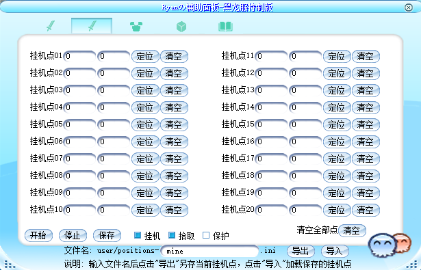
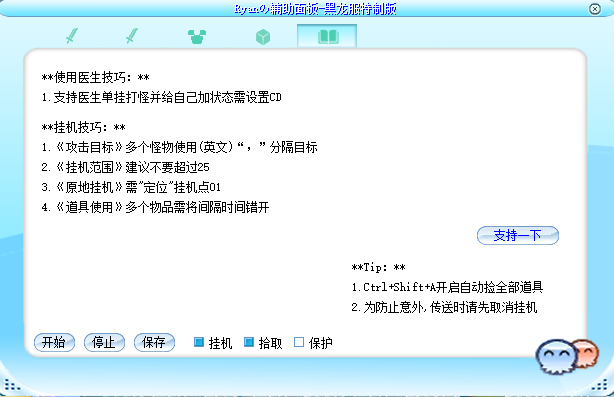

# Ryanの辅助面板
本项目由Ryan基于MiLi提供的2024年基础版本进行二次开发升级制作。

## ⚠️ 重要提示

**此内挂补丁需客户端开放API，非所有端都可使用，请自行甄别**

代码文件默认使用简体中文GB2312编码。


## 📋 功能特性

- 🎯 **智能挂机系统**：支持20个挂机点，智能巡逻与沿途打怪
- 🏥 **医生辅助功能**：自动治愈术、增益技能管理、HP/SP监控
- 📦 **物品拾取系统**：多种拾取模式，支持指定物品拾取，拖拽式管理
- 🎯 **智能跟随系统**：双层跟随策略，智能距离判断，跟随优先打怪
- 🛡️ **保护机制**：HP/SP双档道具使用，定时物品，安全时间控制
- 👥 **组队功能**：自动邀请与确认组队
- 💾 **配置管理**：挂机点导入导出，配置持久化

## 📖 版本说明

**[查看版本详细说明](docs/版本详细说明.md)**

## 📝 更新日志

### 20250831 -v7.1 🆕
  - 智能跟随系逻辑重构，打怪模式中优先跟随，确保有效距离内不会乱跑
  - 新增双层跟随策略：强制跟随 + 逻辑跟随，确保跟随无死角
  - 新增距离判断逻辑：基于搜索范围的智能距离检测
  - 优化跟随触发条件：超过5格距离时强制跟随，5格内正常游戏逻辑
  - 新增跟随范围限制：最大搜索范围25格，避免性能问题
  - 智能跟随判断：附近无目标时自动停止跟随，避免无效操作
  - 增强错误提示：未设置跟随目标时显示友好提示信息
  - 修复函数命名：统一Handle系列函数命名规范，提高代码质量

### 20250831 -v7.0
**重大功能升级 - 物品拾取系统重构**
  - 新增指定物品拾取模式：支持精确控制拾取目标，避免拾取无用物品
  - 新增拖拽式物品管理：支持将游戏内道具直接拖拽到输入框，操作更直观
  - 对接API：实现按物品名称精确拾取
  - 优化物品列表：从18个槽位调整为16个，适配UI界面美观性
  - 重构UI界面：移除复杂的"物品名称过滤模式"，简化为"只拾取指定物品"选项
  - 优化代码模块存储字段逻辑
  - 清理冗余代码：移除所有"功能暂不支持"相关代码
  - 保留清空全部按钮和单个删除功能，操作更便捷
  - 添加"支持将道具拖入输入框"提示，引导用户正确操作

### 20250828 -v6.5
- 优化医生单挂打怪使用增益技能逻辑：仅当自身没有该状态时才释放相应技能，避免重复施放。

### 20250824 -v6.4
- 优化UI布局
- 优化自动邀请组队与自动确认组队功能逻辑
- 新增"物品过滤"功能：（暂无API对接，无法使用）
  - 过滤模式为"不过滤""白名单""黑名单"，默认为"不过滤"
  - 18个物品槽位，支持动态插入与全部清空，支持任意单项删除

### 20250823 -v6.3
- 优化UI界面布局
- 增加道具使用栏：HP/SP双档(低值与常规)优先使用低值道具 & 6位定时物品
- 增加道具使用默认值,HP/SP低值/常规值50/80,定时物品60/61/62/63/64/65
- 修复与优化自动喊话功能 & 优化默认间隔为30秒最低可设5秒
- 新增"拾取全部"功能 同时拾取类型默认为"拾取全部" & 优化拾取延迟默认值为500毫秒最低可设100毫秒
- 说明Tab页面增加"支持一下"按钮，浏览器跳转到我的页面

### 20250822 -v6.2
- 优化挂机点导入功能，增加文件不存在检测机制
- 优化道具使用安全时间为全局道具

### 20250822 -v6.1
- 优化UI界面
- 新增：挂机点导入导出功能与交互提示，便于跨图/多号复用坐标与范围

### 20250822 -v6
- 优化代码结构移除重复代码，统一规范
- 新增：挂机点全部清空功能
- 优化：增加道具使用安全时间
- 新增：道具使用(秒)最小默认值为1

### 20250518 -v5.3
- 优化处理攻击状态逻辑顺序
- 优化UI界面，详细说明与使用提示独立一标签页
- 新增：治愈术阀值默认值限定范围0-100，默认85
- 新增：挂机点增加至20个点

### 20250420 -v5.2
- 优化：目标判空与属性判空更严谨，规避偶发空引用

### 20250420 -v5.1
- 优化：挂机点增加至12个点，并增加提示语"正在前往哪个点"
- 优化：移除检测技能栏中是否存在治愈术。增加治愈术阀值选项配置UI界面（可自行设置HP百分比），治愈术无需再拖入技能栏。增加使用治愈术提示语

### 20250321 -v5
- 优化：修复修改攻击目标再改回"全部"不生效问题

### 20250321 -v4
- 优化调整使用治愈术与医生打怪加状态判断条件：
  - 医生单挂时使用增益技能条件：不勾选"医生挂机"并且目标为"怪"
  - 医生非单挂时治愈术逻辑改为："医生挂机"选项勾选不勾选都可触发，但目标要为"人"

### 20250321 -v3
- 新增：检测技能栏中存在"治愈术"时才会（低于85%）自动加HP

### 20250320 -v2
- 新增：医生单挂打怪并给自己加状态和（低于80%）自动加HP功能（需准确设置状态技能CD时间）

### 20250320 -v1
- 优化：沿途打怪逻辑改进，移动阶段尝试就地攻击命中的怪，再继续移动，减少空跑

## 🖼️ 界面预览

### 主界面


### 挂机设置


### 拾取设置


### 保护设置


### 说明页面


## 📁 项目结构

```
HDW-Plugin/
├── docs/                    # 文档目录
│   ├── 更新日志.txt        # 更新日志
│   ├── 版本详细说明.md     # 详细版本说明
│   └── 示例图片*.png       # 界面示例图片
├── scripts/                 # 脚本目录
│   ├── lua/                # Lua脚本
│   │   └── plug/           # 插件脚本
│   │       ├── main.lua    # 主程序
│   │       ├── mode-fights.lua  # 战斗模式
│   │       ├── mode-pick.lua    # 拾取模式
│   │       └── mode-safe.lua    # 安全模式
│   └── ui/                 # UI配置
│       └── plug.xml        # 界面布局
└── texture/                # 资源文件
    ├── ui/                 # UI资源
    └── Ui2022/             # UI资源
```

## 🔧 技术特性

- **Lua 5.1兼容**：保持与旧版本兼容性
- **配置持久化**：自动保存用户设置
- **错误处理**：完善的异常处理机制
- **模块化设计**：功能模块独立，便于维护
- **拖拽交互**：支持游戏内道具拖拽到界面输入框
- **智能拾取**：支持指定物品名称的精确拾取控制

## 🤝 支持

如有问题或建议，请通过项目Issues反馈。

## ☕ 支持一下

如果这个项目对您有帮助，欢迎请Ryan喝杯咖啡！


## 🚫 声明

**强烈谴责并严正声明：**

任何未经授权的抄袭、剽窃行为，包括但不限于：
- 直接复制代码并篡改作者署名
- 修改项目标题声称原创
- 删除或替换原作者信息
- 未经许可的商业行为

请尊重原创作者的劳动成果，遵守开源协议，保持代码的完整性和作者信息的真实性。

**开源不等于可以剽窃成果，更不等于可以随意篡改作者信息进行商用！**


---